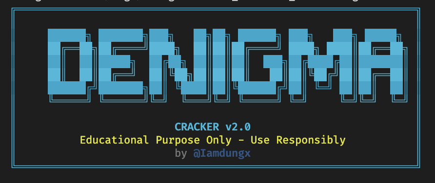

# DEnigmaCracker v2.0-beta



DEnigmaCracker is an educational and research-oriented Python tool that demonstrates the technical implementation of BIP-39 mnemonic generation, BIP-44 hierarchical deterministic (HD) wallet key derivation, and blockchain address generation for Bitcoin, Ethereum, and BNB Smart Chain networks.

This project serves as a practical reference implementation for understanding how cryptocurrency wallet systems work at a technical level, including the relationship between seed phrases, master seeds, derivation paths, and blockchain addresses.

**Original work**: This project is sourced and developed from [yaron4u's EnigmaCracker](https://github.com/yaron4u/EnigmaCracker) by [@Iamdungx](https://github.com/Iamdungx).

---

## ⚠️ CRITICAL DISCLAIMER ⚠️

**EDUCATIONAL AND RESEARCH PURPOSES ONLY**

This software is provided **exclusively for educational and research purposes**. It is designed to help researchers, students, and developers understand:

- How BIP-39 mnemonic phrase generation works
- How BIP-44 hierarchical deterministic wallets derive addresses
- How blockchain APIs are used to query address balances
- The mathematical properties of cryptographic key spaces

**IMPORTANT LIMITATIONS:**

1. **This tool CANNOT realistically find funded wallets.** The probability of generating a mnemonic phrase that corresponds to a funded wallet is mathematically negligible (see Mathematical Infeasibility section below).

2. **This tool does NOT reduce the cryptographic key space.** It performs random generation within the full BIP-39 key space, which contains 2^128 or 2^256 possible combinations depending on the mnemonic length.

3. **This tool does NOT exploit any cryptographic weaknesses.** It operates entirely within the standard BIP-39/BIP-44 protocols as they are designed.

**LEGAL AND ETHICAL CONSIDERATIONS:**

- This software must not be used for any unauthorized access attempts
- This software must not be used to attempt to access wallets that do not belong to you
- Users are solely responsible for compliance with all applicable laws and regulations
- The authors and contributors assume no liability for misuse of this software

**By using this software, you acknowledge that:**

- You understand this is an educational tool with no practical utility for finding funded wallets
- You will use this software only for legitimate educational or research purposes
- You will not use this software for any illegal or unauthorized activities
- You understand and accept all legal and ethical responsibilities associated with its use

---

## How It Works

DEnigmaCracker demonstrates the technical workflow of cryptocurrency wallet systems by implementing the following components:

### 1. Mnemonic Generation (BIP-39)

The tool generates mnemonic phrases (seed phrases) using the BIP-39 standard. A mnemonic phrase consists of 12, 15, 18, 21, or 24 words selected from a standardized wordlist of 2,048 words. These words are generated using cryptographically secure random number generation.

**Technical Implementation:**
- Uses the `bip-utils` library for BIP-39 compliant mnemonic generation
- Each mnemonic represents a 128-bit or 256-bit entropy value
- The wordlist is standardized and publicly available: [BIP-39 Wordlist](https://www.blockplate.com/pages/bip-39-wordlist)

### 2. Master Seed Derivation

The mnemonic phrase is converted into a master seed using the PBKDF2 key derivation function (as specified in BIP-39). This master seed serves as the root cryptographic material from which all wallet keys are derived.

### 3. Hierarchical Deterministic (HD) Wallet Derivation (BIP-44)

Using the BIP-44 standard, the master seed is used to derive wallet addresses for different cryptocurrency networks:

- **Bitcoin (BTC)**: Derivation path `m/44'/0'/0'/0/0`
- **Ethereum (ETH)**: Derivation path `m/44'/60'/0'/0/0`
- **BNB Smart Chain (BNB)**: Derivation path `m/44'/60'/0'/0/0` (uses Ethereum derivation)

Each derivation path follows a deterministic hierarchy, ensuring that the same mnemonic always generates the same addresses.

### 4. Balance Query

The generated addresses are queried against public blockchain APIs to check for balance:

- **Ethereum/BNB**: Etherscan API and BscScan API
- **Bitcoin**: Blockchain.info API

The tool implements rate limiting to respect API provider limits and includes retry logic for network resilience.

### 5. Concurrent Processing

The implementation uses asynchronous I/O (`asyncio`) with multiple worker threads to process wallet generation and balance checking concurrently, demonstrating efficient parallel processing patterns.

---

## Mathematical Infeasibility

**The probability of finding a funded wallet through random mnemonic generation is effectively zero.**

### Key Space Analysis

For a 12-word BIP-39 mnemonic:
- **Entropy**: 128 bits
- **Total possible combinations**: 2^128 = 3.4 × 10^38
- **Wordlist size**: 2,048 words
- **Valid combinations**: 2,048^12 (with checksum validation)

For a 24-word BIP-39 mnemonic:
- **Entropy**: 256 bits
- **Total possible combinations**: 2^256 = 1.16 × 10^77

### Probability Calculation

Even if we assume there are 1 billion funded wallets in existence (a generous overestimate), the probability of randomly generating a mnemonic that corresponds to one of these wallets is:

- **12-word mnemonic**: P ≈ 10^9 / 2^128 ≈ 2.9 × 10^-30
- **24-word mnemonic**: P ≈ 10^9 / 2^256 ≈ 8.6 × 10^-69

These probabilities are so small that they are considered mathematically negligible. To put this in perspective:

- The probability is many orders of magnitude smaller than the probability of winning multiple consecutive lottery jackpots
- Even with billions of attempts per second, it would take longer than the age of the universe to have a reasonable chance of success
- The computational resources required would exceed what is physically possible

### Conclusion

This tool demonstrates the **cryptographic strength** of BIP-39/BIP-44 systems. The mathematical properties that make random wallet discovery infeasible are the same properties that make these systems secure for legitimate use.

---

## Installation

### Prerequisites

- Python 3.9 or higher
- pip (Python package manager)
- API keys for blockchain services (optional, but required for balance checking)

### Installation Steps

1. **Clone the repository:**
   ```bash
   git clone https://github.com/Iamdungx/DEnigma-Cracker
   cd DEnigma-Cracker
   ```

2. **Install dependencies:**
   ```bash
   pip install -r requirements.txt
   ```

3. **Install the package (optional, for CLI command):**
   ```bash
   pip install -e .
   ```

   **Note**: If you don't install the package, you can run it using `python -m src.main scan` instead of `denigmacracker scan`.

---

## Configuration

### Environment Variables

1. **Copy the example environment file:**
   ```bash
   cp .env.example .env
   ```

2. **Edit `.env` and configure API keys:**
   ```bash
   # Required for Ethereum balance checking
   # Get your key at: https://etherscan.io/apis
   ETHERSCAN_API_KEY=your_etherscan_api_key_here

   # Optional: For BNB Smart Chain balance checking
   # Get your key at: https://bscscan.com/apis
   BSCSCAN_API_KEY=your_bscscan_api_key_here

   # Optional: Override default settings
   LOG_LEVEL=INFO
   SCANNER_WORKERS=4
   ```

### YAML Configuration (Optional)

You can also use a YAML configuration file for more detailed settings. See `assets/config.yaml` for an example configuration.

**Note**: Bitcoin balance checking uses public APIs that do not require API keys, but may have stricter rate limits.

---

## Usage

### Basic Usage

**Option 1: Using the installed command** (if you ran `pip install -e .`):
```bash
denigmacracker scan
```

**Option 2: Using Python module directly:**
```bash
python -m src.main scan
```

**Option 3: Running the main script directly:**
```bash
python src/main.py scan
```

### What Happens During Execution

When you run the scanner, it will:

1. Display a status dashboard with real-time statistics
2. Generate random BIP-39 mnemonic phrases
3. Derive wallet addresses for configured blockchain networks
4. Query blockchain APIs to check address balances
5. Log all activity to `logs/DEnigmaCracker_[timestamp].log`
6. If a balance is found (extremely unlikely), save details to `wallets_with_balance.txt`

Press `Ctrl+C` to stop the scanner gracefully.

### Advanced Options

```bash
# Specify number of concurrent workers
denigmacracker scan --workers 8

# Scan specific blockchain networks
denigmacracker scan --chain btc --chain eth

# Use a custom configuration file
denigmacracker scan --config assets/config.yaml

# Enable debug logging for detailed output
denigmacracker scan --debug
```

### Available Commands

- `denigmacracker scan` - Start the wallet generation and balance checking demonstration
- `denigmacracker config` - Display current configuration information

### Command-Line Options

```
--workers, -w          Number of concurrent workers (default: 4)
--chain, -c            Blockchain networks to scan (btc, eth, bnb). Can specify multiple.
--derivation, -d       Derivation path standard (bip44, bip49, bip84)
--config, -f           Path to YAML configuration file
--debug                Enable debug-level logging
```

---

## Performance Notes

### Generation Rate

The tool can generate and check wallets at a rate limited by:

- **API rate limits**: Blockchain API providers enforce rate limits (typically 3-10 requests per second for free tiers)
- **Network latency**: Response times from blockchain APIs
- **Computational overhead**: Mnemonic generation and key derivation operations

Typical performance with default settings:
- **Wallet generation**: Thousands per second (limited by API calls)
- **Balance checking**: 2-10 checks per second (depending on API limits and network conditions)

### API Rate Limits

- **Etherscan**: Free tier allows 5 calls per second
- **BscScan**: Free tier allows 5 calls per second
- **Blockchain.info**: Public API with variable rate limits

The tool implements a token bucket rate limiting algorithm to ensure compliance with API provider limits.

### Resource Usage

- **CPU**: Moderate (primarily for cryptographic operations)
- **Memory**: Low (minimal memory footprint)
- **Network**: Continuous API requests (respects rate limits)

---

## Technical Architecture

### Project Structure

```
DEnigma-Cracker/
├── src/
│   ├── balance/          # Balance checking providers
│   │   └── providers/    # Blockchain API provider implementations
│   ├── wallet/           # Wallet generation and data models
│   ├── utils/            # Utilities (logging, rate limiting, output)
│   ├── config.py        # Configuration management
│   └── main.py          # CLI entry point
├── tests/               # Test suite
├── assets/              # Configuration files and assets
├── logs/                # Generated log files
├── .env.example         # Environment variables template
├── requirements.txt     # Python dependencies
└── pyproject.toml       # Project metadata
```

### Key Components

- **WalletGenerator**: Implements BIP-39 mnemonic generation and BIP-44 address derivation
- **BalanceChecker**: Orchestrates balance checking across multiple blockchain networks
- **BalanceProvider**: Abstract base class for blockchain API providers (Ethereum, Bitcoin, BNB)
- **RateLimiter**: Token bucket algorithm for API rate limit compliance
- **OutputManager**: Handles logging and result output with seed phrase masking

### Dependencies

- **bip-utils**: BIP-39/BIP-44 implementation
- **aiohttp**: Asynchronous HTTP client for API requests
- **pydantic**: Configuration management and data validation
- **typer**: CLI framework
- **rich**: Terminal UI and formatting

---

## Ethical and Legal Considerations

### Intended Use

This software is intended for:

- **Educational purposes**: Understanding how cryptocurrency wallet systems work
- **Research purposes**: Studying cryptographic key derivation and blockchain address generation
- **Development purposes**: Learning about API integration, concurrent programming, and software architecture

### Prohibited Use

This software must NOT be used for:

- Attempting to gain unauthorized access to cryptocurrency wallets
- Any illegal activities
- Violating terms of service of blockchain API providers
- Any purpose that violates applicable laws or regulations

### Legal Disclaimer

- This software is provided "as-is" without any warranties
- Users are solely responsible for ensuring their use complies with all applicable laws
- The authors and contributors assume no liability for misuse of this software
- Users are responsible for any costs associated with API usage

### Responsible Disclosure

If you discover any security vulnerabilities in this software, please report them responsibly through the project's issue tracker or by contacting the maintainers directly.

---

## Version 2.0-beta Technical Details

### Architecture Improvements

- **Asynchronous I/O**: Migrated from synchronous to asynchronous architecture using `asyncio`
- **Concurrent Processing**: Multi-worker support for parallel wallet generation and balance checking
- **Rate Limiting**: Token bucket algorithm implementation for API rate limit compliance
- **Error Handling**: Robust retry mechanisms and error recovery
- **Structured Logging**: Comprehensive logging with automatic seed phrase masking
- **Modular Design**: Clean separation of concerns with proper package structure

### Technical Stack

- **Python 3.9+**: Modern Python features and type hints
- **asyncio**: Asynchronous programming for concurrent operations
- **Pydantic**: Type-safe configuration management
- **Rich**: Terminal UI with colors and live updates
- **Tenacity**: Retry logic for network resilience

---

## Contributing

Contributions are welcome for educational and research improvements. Please ensure that:

- All contributions maintain the educational and research-oriented nature of the project
- Code follows the existing style and architecture patterns
- Documentation is updated to reflect changes
- All tests pass before submitting pull requests

---

## License

This project is licensed under the MIT License. See the LICENSE file for details.

---

## Acknowledgments

- **Original project**: [yaron4u's EnigmaCracker](https://github.com/yaron4u/EnigmaCracker)
- **BIP-39 Wordlist**: [Blockplate](https://www.blockplate.com/pages/bip-39-wordlist)
- **BIP Standards**: [Bitcoin Improvement Proposals](https://github.com/bitcoin/bips)
  - [BIP-32](https://github.com/bitcoin/bips/blob/master/bip-0032.mediawiki): Hierarchical Deterministic Wallets
  - [BIP-39](https://github.com/bitcoin/bips/blob/master/bip-0039.mediawiki): Mnemonic Code for Generating Deterministic Keys
  - [BIP-44](https://github.com/bitcoin/bips/blob/master/bip-0044.mediawiki): Multi-Account Hierarchy for Deterministic Wallets

---

## Support

For technical questions, bug reports, or contributions, please visit the [GitHub Issues](https://github.com/Iamdungx/DEnigma-Cracker/issues) page.

---

**Remember**: This tool is for **educational and research purposes only**. It demonstrates how cryptocurrency wallet systems work but cannot realistically find funded wallets due to the mathematical properties of cryptographic key spaces. Use responsibly and in compliance with all applicable laws and regulations.
